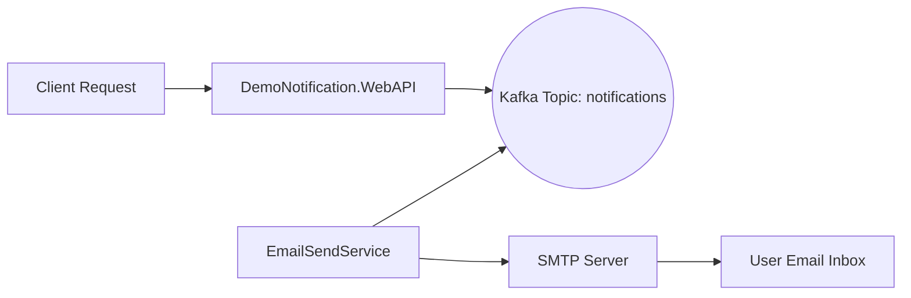

# 📬 DemoNotification — Email Notification System

A project built with ASP.NET 9 and Apache Kafka that implements an asynchronous email notification system. Designed to demonstrate microservices architecture, message broker integration, and email sending via SMTP.

---

## 🏗️ Architecture



* **DemoNotification.WebAPI** — receives requests, validates input, logs, and publishes messages to Kafka.
* **DemoNotification.EmailSendService** — subscribes to Kafka, processes events, and sends emails via SMTP.
* **Kafka** — acts as a message broker between services.

---

## 🚀 Getting Started

### ✅ Prerequisites

* Docker
* Docker Compose

### 🏁 Run the Project

```bash
cd deploy
docker-compose up --build
```

Once started successfully, the WebAPI will be available at:

* [http://localhost:5000](http://localhost:5000)

---

## 🔌 API Request Example

```http
POST http://localhost:5000/notifications/send
Content-Type: application/json

{
  "email": "test@example.com",
  "subject": "Hello from DemoNotification",
  "message": "This is a test email."
}
```

If the system is set up correctly:

* WebAPI will send the message to Kafka
* EmailSendService will receive it and send an email to the provided address

---

## ⚙️ Environment Variables

### EmailSendService

| Variable                  | Description                               |
| ------------------------- | ----------------------------------------- |
| `Kafka__BootstrapServers` | Kafka broker address (e.g., `kafka:9092`) |
| `Smtp__Host`              | SMTP server (e.g., `smtp.example.com`)    |
| `Smtp__Port`              | SMTP port (`25`, `465`, or `587`)         |
| `Smtp__Username`          | SMTP username                             |
| `Smtp__Password`          | SMTP password                             |
| `Smtp__From`              | Default sender email address              |

---

## 📁 Project Structure

```text
DemoNotification.WebAPI/           # ASP.NET Web API
DemoNotification.EmailSendService/ # Background worker service
deploy/                            # Docker and infrastructure
```

---

## 📦 Technologies & Dependencies

* [.NET 9 SDK](https://dotnet.microsoft.com/)
* [Apache Kafka](https://kafka.apache.org/)
* [System.Net.Mail (SmtpClient)](https://learn.microsoft.com/dotnet/api/system.net.mail.smtpclient)

---

## 🔐 Security Considerations

* Use trusted SMTP servers with TLS/SSL support
* Kafka does not use encryption by default — consider setting up SSL and ACLs
* WebAPI lacks authentication — consider adding JWT or OAuth if needed

---

## 📈 Possible Extensions

* 🔄 Retry policies using built-in .NET mechanisms
* ❤️ Health-check endpoints like `/status`
* 🗃️ Logging and storing sent messages (e.g., in PostgreSQL)
* 📘 API documentation using Swagger / OpenAPI
* ⚙️ Improved Kafka resilience (replication, Kafka Connect)
* 📊 Monitoring with Grafana + Prometheus
